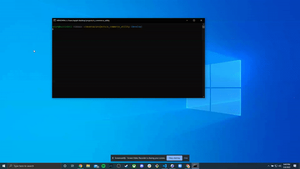

# Ecommerce Utility 

# About

Ecommerce Utility is an application to see and modify contents of an ecommerce platform. In this application, you can create listings for new products, as well as categories and tags to list these products under. It comes with means to add, delete, and modify any entry into the database. You can full the entire listing of products/categories/tags, or view individual entries by their specific ID.

## Table of Contents

- [Intallation](#installation)
- [Usage](#usage)
- [Credit](#credit)
- [License](#license)
- [Contribute](#contribute)
- [Questions](#test)

# Installation

Download the repo. In your terminal, navigate to the location of the download and enter 'npm i' to install the necessary node modules to run Ecommerce Utility. Create a .env file that contains the name of your database, as well as your MySQL username and password. With these in place, you will need to access MySQL and run 'source db/schema' to create the new database. Exit MySQL. In your terminal, enter 'npm start seed' to use the seed that is packaged with the application to prefill products/categories/tags. Run the command 'npm start' to launch the application.

# Usage

When the application launches, it will be hosted on localhost:3001. Using Insomina, create GET commands routing to the localhost domain, followed by / and whatever information you wish to view (/tags, /products, /categories). If you want to view a particular entry, follow the route with / and the ID of the entry (/tags/1 for example). Use the ID entry method for PUT and DELETE commands as well to modify or delete an entry. A put command should be similar to the JSON you use to create the entry, only using the new information. ID's will be automatically generated in an increasing numeric order, and ID's will not be re-used by the application (If you create a new prodcut with an ID of 1 and then delete it, the next producted created will have an ID of 2). If you are given an error, be sure to double check the route you've entered, or the JSON you used to create the entry.

# Credit

Created by Austin Carter.

# License

This project is covered under the gpl3.0 license. For more information, visit this [resource](https://choosealicense.com/licenses/) on project licenses.

# Contribute

No contributions are being accepted at this time. If you would like to make changes to the application, feel free to fork and modify.

# Questions

If you have any questions, you can find me on [github](https://github.com/auscarter17).
